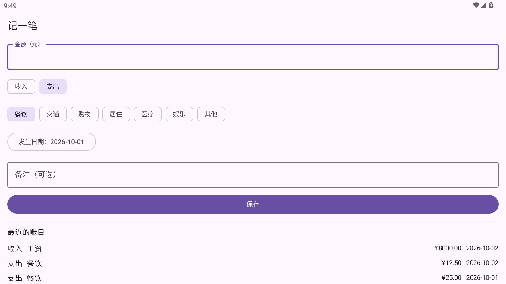

# 记账宝

面向**按工时计酬者**的个人记账 App。

普通记账 App 假设你有固定月薪，只回答「我花了多少」；记账宝同时回答「**我挣了多少**」，
并把「工时 → 工资 → 每日收入」这条链路自动化。

- 平台：Android（`minSdk 26` / `compileSdk 37`），应用 ID `com.jizhangbao.app`
- **离线优先**：本机数据库是唯一事实源，**无后端、无网络上传**（见 [PRIVACY.md](PRIVACY.md)）
- 单人开发、自用侧载（不上架应用商店）

---

## 当前状态（请如实看待）

**第一条端到端业务路径已打通：手动记一笔账目条目**（`REQ-001` / `T-007`）。
五个上下文里只有 Ledger 长出了肉，其余四个仍只有模块骨架。

| 已经有的 | 还没有的 |
|---|---|
| **记一笔支出 / 收入**：金额、方向、分类、发生时间（可补记）、备注 | 编辑已保存的条目、删除条目（`T-008`） |
| 账本列表（按发生时间倒序），数据存在本机 Room（`ledger_entry` 表） | 自定义分类、账户与余额、多币种（见 `ADR-0005`） |
| 11 个 Gradle 模块 + `build-logic` 约定插件 | 工时 / 薪资 / 日历 / 统计四个上下文的模型与界面 |
| 提交前门禁：detekt、Android Lint、**57 个测试**、架构规则机器强制 | 通知监听、地理围栏（`Q-001` / `Q-002` 之后） |
| GitHub Actions CI + 追溯矩阵（10 条验收标准里 8 条有提交与测试证据） | 备份与导出（`Q-006`） |



> 上图是在模拟器上实机操作的真实截图（补记了一笔 10-01 的账，它按发生时间排在最后）。
> 视觉暂用 Material 3 默认配色（`Q-020` 未定，`:core:ui` 里是**单点**降级）。
>
> **为什么另外四个上下文还没做**：`Q-015`（缺勤与法定节假日是否带薪）卡住 Payroll、
> `Q-016`（节假日数据来源）卡住 Calendar，而领域模型必须由澄清后的需求倒推。
> 宁可先停住，也不猜着写进代码——未决问题清单见
> [docs/20-domain/open-questions.md](docs/20-domain/open-questions.md)。

---

## 构建

| 前置条件 | 版本 / 说明 |
|---|---|
| JDK | **21** |
| Android SDK | 需含 `platforms;android-37.0`、`build-tools;37.0.0`、`platform-tools` |
| Gradle | **不需要单独安装**——用仓库自带的 Wrapper（`gradlew`） |

```bash
git clone https://github.com/pyyyyp/Bookkeeping.git
cd Bookkeeping

# local.properties 不入库，需自建（Windows 下用正斜杠更稳妥）
#   sdk.dir=<你的 Android SDK 路径>

./gradlew assembleDebug            # Linux / macOS
.\gradlew.bat assembleDebug        # Windows（PowerShell / cmd）

# 产物：app/build/outputs/apk/debug/app-debug.apk
```

> **Windows 用户注意**：本文档与 `AGENTS.md` 里多数命令写的是 `./gradlew`（bash 写法），
> 在 PowerShell / cmd 里要换成 `.\gradlew.bat`。两者等价——用的是同一个 Wrapper。
>
> 这段步骤**在本仓库真实验证过**：在干净目录 clone 后照做，`BUILD SUCCESSFUL`。

装 SDK 组件、Windows 上的注意事项、以及本地怎么跑与 CI 相同的门禁，
见 [CONTRIBUTING.md](CONTRIBUTING.md)。构建手册（含踩过的坑）见
[docs/60-runbooks/build.md](docs/60-runbooks/build.md)。

---

## 项目结构

```
app/                  应用宿主：唯一可同时依赖多个 feature 的模块，不含业务规则
core/domain/          共享内核（纯 Kotlin JVM 模块，无 Android 类路径）
core/common/          日志 / 时间 / 调度器等基础设施
core/ui/              Compose 设计系统
core/data/            数据层基础设施（Room / KSP 已装配）
core/testing/         测试基础设施（含架构断言）
feature/ledger/       账本（核心域）
feature/worklog/      工时（核心域）
feature/payroll/      薪资（核心域）
feature/calendar/     工作日历（支撑域）
feature/insight/      统计（支撑域，读模型）
build-logic/          构建约定插件（模块配置、架构校验、静态分析）
```

**一个限界上下文 = 一个 Gradle 模块**。上下文的职责与协作方式见
[docs/20-domain/context-map.md](docs/20-domain/context-map.md)。

---

## 架构约束（机器强制，不是口号）

| 约束 | 怎么被强制 |
|---|---|
| `domain` 层不得引用 Android / 框架 | `core:domain` 是 `kotlin("jvm")` 模块，**没有 Android 类路径，想写也写不出来**；feature 内的 `domain` 包由 `verifyDomainPurity` 逐文件扫描 |
| `feature` 之间不得互相依赖 | `checkModuleDependencies` 校验依赖声明（只有 `:app` 可以依赖 feature）；Konsist 断言再查源码引用 |
| 外部模型（DTO / Entity）不得进入领域层 | Konsist 断言 `ArchitectureTest` |
| 代码风格与代码味道 | detekt（配置在 `config/detekt/detekt.yml`） |

这些校验都接在 `check` 生命周期上，`./gradlew build` 会自动执行——
**违规会让构建失败，而不是只出现在报告里**。

---

## 文档

`docs/` 是项目事实的唯一权威来源，`AGENTS.md` 是操作规则。几个入口：

| 想了解 | 看 |
|---|---|
| 项目做什么、不做什么 | [docs/00-charter/vision.md](docs/00-charter/vision.md) |
| 术语的确切含义 | [docs/00-charter/glossary.md](docs/00-charter/glossary.md) |
| 版本与选型 | [docs/00-charter/tech-baseline.md](docs/00-charter/tech-baseline.md) |
| 上下文边界与协作 | [docs/20-domain/context-map.md](docs/20-domain/context-map.md) |
| 未决问题 | [docs/20-domain/open-questions.md](docs/20-domain/open-questions.md) |
| 架构决策（ADR） | [docs/30-architecture/](docs/30-architecture/) |
| 进度与验收证据 | [docs/90-trace/traceability.md](docs/90-trace/traceability.md) |

---

## 隐私

**不申请权限、不联网、不收集数据。** 每条结论都在 [PRIVACY.md](PRIVACY.md) 里给了
可自行核对的命令——它是与代码对应的说明书，不是愿景宣言。

## 参与开发

先读 [AGENTS.md](AGENTS.md)（操作规则）与 [CONTRIBUTING.md](CONTRIBUTING.md)（怎么跑）。
本项目采用文档驱动 + DDD 的工作方式：**先想清楚 → 再写下来 → 再实现 → 再验证 → 最后提交**。

## 许可证

[MIT](LICENSE)
